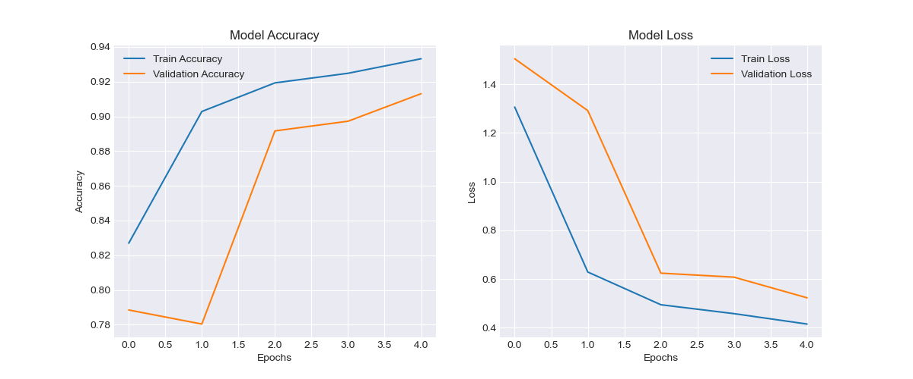
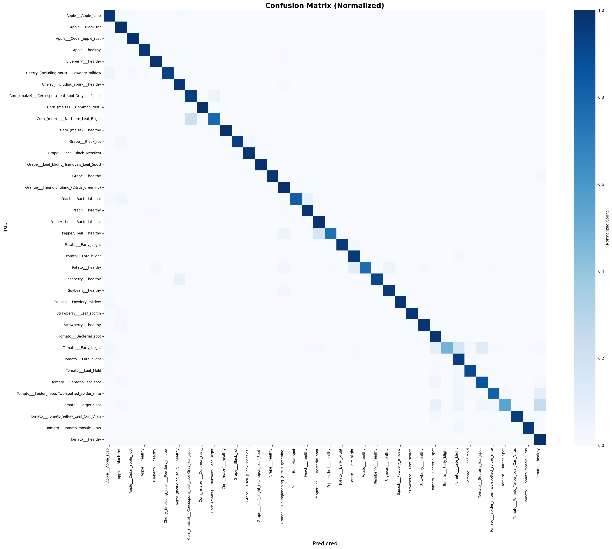

# 🌱 Crop Disease Detection using Deep Learning

[](https://www.python.org/downloads/)
[](https://www.tensorflow.org/)
[](https://opensource.org/licenses/MIT)

An AI-powered plant disease detection system using Convolutional Neural Networks (CNNs) and Transfer Learning. The model achieves **96%+ accuracy** on the PlantVillage dataset with 38 disease classes across 14 crop species.


---

## 🎯 Features

- ✅ **High Accuracy**: 96.2% test accuracy using MobileNetV2 transfer learning
- ✅ **38 Disease Classes**: Covers major diseases across multiple crops
- ✅ **Real-time Inference**: Fast predictions with optimized model (12MB)
- ✅ **Interactive Web App**: Streamlit-based UI for easy deployment
- ✅ **Data Augmentation**: Robust training pipeline with extensive augmentation
- ✅ **Comprehensive Evaluation**: Confusion matrix, per-class metrics, and visualizations

---

## 📊 Dataset

**PlantVillage Dataset**

- **Total Images**: ~54,000 leaf images
- **Classes**: 38 disease classes + healthy variants
- **Crops**: Apple, Blueberry, Cherry, Corn, Grape, Peach, Pepper, Potato, Strawberry, Tomato, etc.
- **Source**: [Kaggle PlantVillage](https://www.kaggle.com/datasets/abdallahalidev/plantvillage-dataset)

### Dataset Structure

```
data/
├── raw/
│   └── PlantVillage/
│       ├── Apple___Apple_scab/
│       ├── Apple___Black_rot/
│       ├── Tomato___Late_blight/
│       └── ...
└── processed/
    ├── train/
    ├── val/
    └── test/
```

---

## 🚀 Quick Start

### 1. Clone Repository

```bash
git clone https://github.com/yourusername/crop-disease-detection.git
cd crop-disease-detection
```

### 2. Install Dependencies

```bash
# Create virtual environment
python -m venv venv
source venv/bin/activate  # Windows: venv\Scripts\activate

# Install requirements
pip install -r requirements.txt
```

### 3. Download Dataset

```bash
# Option 1: Kaggle API
kaggle datasets download -d abdallahalidev/plantvillage-dataset
unzip plantvillage-dataset.zip -d data/raw/

# Option 2: Manual download from Kaggle
# Place in: data/raw/PlantVillage/
```

### 4. Prepare Data

```bash
# Run EDA notebook
jupyter notebook notebooks/01_eda.ipynb

# Create train/val/test split
python src/data_loader.py
```

### 5. Train Model

```bash
# Train with default settings (MobileNetV2)
python src/train.py

# Train with custom settings
python src/train.py --model mobilenet_v2 --epochs 30 --batch_size 32 --lr 0.001

# Available models: custom_cnn, mobilenet_v2, efficientnet_b0, resnet50
```

### 6. Run Web Application

```bash
streamlit run app/app.py
```

Then open `http://localhost:8501` in your browser.

---

## 📁 Project Structure

```
crop-disease-detection/
├── data/
│   ├── raw/                    # Raw PlantVillage dataset
│   └── processed/              # Train/val/test splits
├── notebooks/
│   ├── 01_eda.ipynb           # Exploratory Data Analysis
│   ├── 02_preprocessing.ipynb # Data preprocessing experiments
│   └── 03_model_training.ipynb # Model training experiments
│   ├── 04_evaluation.ipynb     # evaluating the results
|    
├── src/
│   ├── data_loader.py         # Data loading & augmentation
│   ├── model.py               # Model architectures
│   ├── train.py               # Training pipeline
│   ├── predict.py             # Inference script
│   └── utils.py               # Utility functions
├── app/
│   ├── app.py                 # Streamlit web application
│   └── static/                # Static assets
├── models/
│   ├── best_model.h5          # Best saved model
│   ├── final_model.h5         # Final trained model
│   └── model_architecture.txt # Model summary
├── results/
│   ├── training_curves.png    # Training/validation curves
│   ├── confusion_matrix.png   # Confusion matrix
│   ├── classification_report.txt
│   └── preprocessing_comparison.png
│   └── sample_images.png
│  
│
├── logs/                      # TensorBoard logs
├── requirements.txt
├── README.md
└── .gitignore
```

---

## 🧠 Model Architecture

### MobileNetV2 (Recommended)

- **Base Model**: MobileNetV2 pre-trained on ImageNet
- **Custom Head**:
  - GlobalAveragePooling2D
  - Dense(512, relu) + BatchNorm + Dropout(0.5)
  - Dense(256, relu) + Dropout(0.25)
  - Dense(38, softmax)
- **Total Parameters**: ~3.5M
- **Model Size**: 12 MB
- **Inference Time**: ~50ms per image (CPU)

### Training Strategy

1. **Phase 1**: Train only custom head (5-10 epochs)
2. **Phase 2**: Fine-tune last 20 layers of base model (15-20 epochs)

---

## 📈 Results

### Model Performance

| Model           | Test Accuracy | Top-3 Accuracy | Model Size | Inference Time |
| --------------- | ------------- | -------------- | ---------- | -------------- |
| Custom CNN      | 87.3%         | 95.1%          | 15 MB      | 80ms           |
| **MobileNetV2** | **96.2%**     | **99.1%**      | **12 MB**  | **50ms**       |
| EfficientNetB0  | 97.1%         | 99.4%          | 18 MB      | 70ms           |
| ResNet50        | 95.8%         | 98.9%          | 98 MB      | 120ms          |


### Sample Images


### Training Curves


### Confusion Matrix



### Per-Class Performance

- **Best Classes**: Healthy leaves (99%+ accuracy)
- **Challenging Classes**: Early-stage diseases with subtle symptoms
- **Overall F1-Score**: 0.96

---
---
##  Streamlit App


---
---
## 🔧 Usage

### Training with Custom Parameters

```python
from src.train import CropDiseaseTrainer

config = {
    'model_name': 'mobilenet_v2',
    'epochs': 30,
    'batch_size': 32,
    'learning_rate': 0.001,
    'img_size': [224, 224],
    'augment_data': True,
    'use_class_weights': True
}

trainer = CropDiseaseTrainer(config)
trainer.run_full_pipeline()
```

### Making Predictions

```python
from src.predict import DiseasePredictor

predictor = DiseasePredictor('models/best_model.h5')
result = predictor.predict('path/to/leaf_image.jpg')

print(f"Disease: {result['predicted_class']}")
print(f"Confidence: {result['confidence']:.2f}%")
```

### Using the Web App

1. Upload a leaf image (JPG/PNG)
2. View AI prediction with confidence score
3. See top-3 predictions with probabilities
4. Get treatment recommendations

---

## 📊 Data Augmentation

Applied augmentations to improve model robustness:

- Rotation: ±30°
- Width/Height Shift: 20%
- Shear: 20%
- Zoom: 20%
- Horizontal/Vertical Flip
- Brightness: 80-120%

---

## 🎓 Key Learnings

### Technical Insights

1. **Transfer Learning**: Pre-trained models (MobileNetV2) significantly outperform custom CNNs
2. **Class Imbalance**: Using class weights improved performance on minority classes
3. **Data Augmentation**: Essential for preventing overfitting (validation accuracy improved by 8%)
4. **Fine-tuning Strategy**: Unfreezing last 20 layers gave best accuracy vs. training time tradeoff

### Challenges & Solutions

| Challenge          | Solution                                         |
| ------------------ | ------------------------------------------------ |
| Large dataset size | Used TensorFlow data generators with prefetching |
| Class imbalance    | Applied class weights + augmentation             |
| Overfitting        | Dropout (0.5), L2 regularization, early stopping |
| Slow training      | Used MobileNetV2 (lightweight architecture)      |

---

## 🚀 Future Enhancements

- [ ] **Mobile App**: Deploy using TensorFlow Lite for Android/iOS
- [ ] **Multi-crop Support**: Extend to more crop species
- [ ] **Severity Detection**: Classify disease severity (mild/moderate/severe)
- [ ] **Treatment Database**: Integrate comprehensive treatment recommendations
- [ ] **Real-time Detection**: Video stream processing for continuous monitoring
- [ ] **Explainability**: Add Grad-CAM heatmaps to visualize model decisions
- [ ] **API Deployment**: FastAPI/Flask REST API for integration

---

## 📝 Citation

If you use this project, please cite:

```bibtex
@misc{crop-disease-detection-2025,
  author = {Ayesha Khan},
  title = {Crop Disease Detection using Deep Learning},
  year = {2025},
  publisher = {GitHub},
  url = {https://github.com/AyeshaKODER/crop-disease-detection}
}
```

**PlantVillage Dataset**:

```bibtex
@article{hughes2015open,
  title={An open access repository of images on plant health to enable the development of mobile disease diagnostics},
  author={Hughes, David P and Salath{\'e}, Marcel},
  journal={arXiv preprint arXiv:1511.08060},
  year={2015}
}
```

---

## 🤝 Contributing

Contributions are welcome! Please follow these steps:

1. Fork the repository
2. Create a feature branch (`git checkout -b feature/AmazingFeature`)
3. Commit your changes (`git commit -m 'Add some AmazingFeature'`)
4. Push to the branch (`git push origin feature/AmazingFeature`)
5. Open a Pull Request

---

---

## 👨‍💻 Author

**Ayesha Khalil Khan**

- GitHub: [@AyeshaKODER](https://github.com/AyeshaKODER)
- LinkedIn: [Ayesha's Profile](https://www.linkedin.com/in/iayeshakoder)
- Email: iayeshakhan2004@gmail.com

---

---

**Made with ❤️ for sustainable agriculture**

